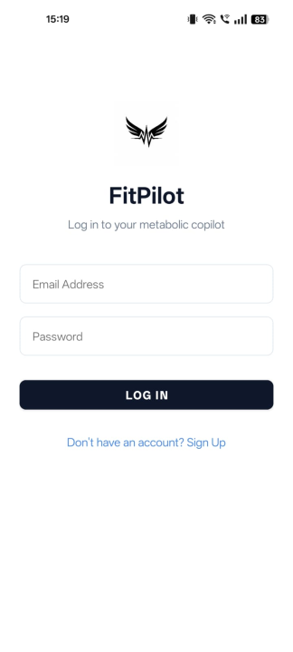
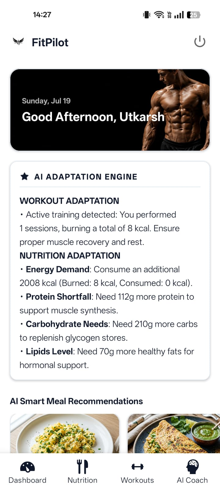
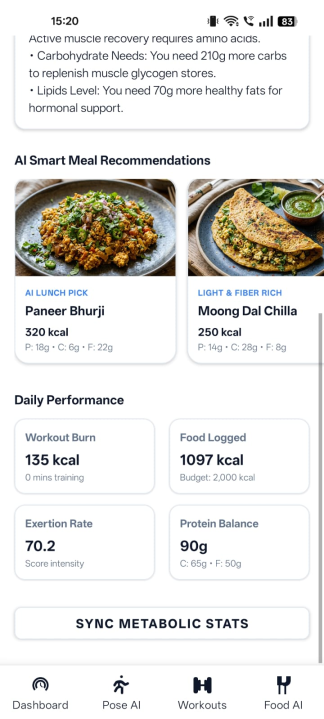
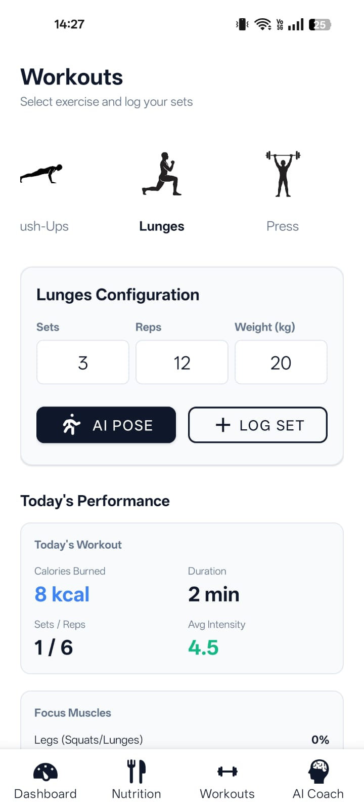
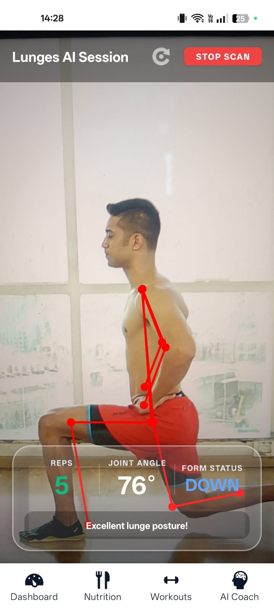
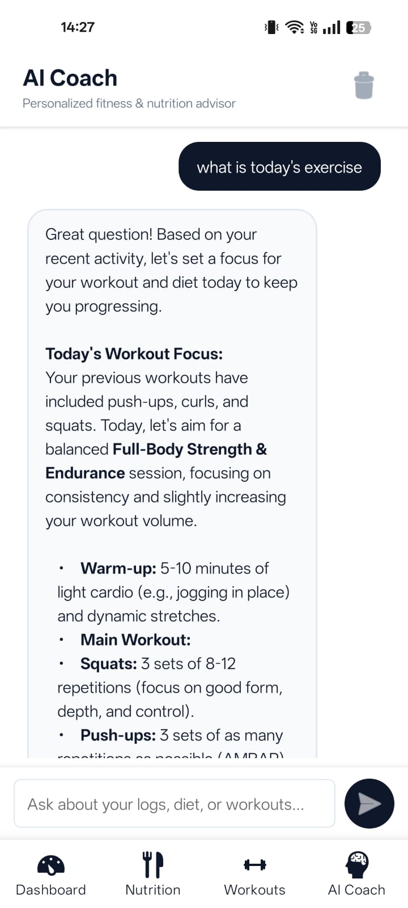

# FitPilot

FitPilot is a modern, professional-grade metabolic tracking and biomechanical training assistant. It combines a FastAPI MongoDB Atlas backend with a native Android Kotlin mobile application.

---

## Technology Stack


### Mobile Frontend
- **Framework**: Native Android Application
- **Language**: Kotlin
- **SDK Compatibility**: Min SDK 23, Target SDK 30
- **Camera integration**: Jetpack CameraX (high performance, lifecycle-aware camera stream)
- **Biomechanical AI**: On-device TensorFlow Lite (`MoveNet` & `PoseNet`) running live coordinates extraction, joint angle mathematics, and rep counter completely client-side.

### Backend Service
- **Framework**: FastAPI
- **ASGI Server**: Uvicorn
- **Async MongoDB Client**: Motor
- **AI Engine**: Google Gemini 2.5 Flash API (via raw HTTPS/HTTPX requests)
- **Security**: Cryptographic password hashing (Bcrypt) & JWT session tokens (PyJWT)

### Database
- **Engine**: MongoDB Atlas (Async Document Store)

---

## App Screens & User Flow

Here is a visual walkthrough of the application interface and user flow:

| 1. Login & Signup Authentication | 2. Daily Activity Dashboard | 3. Nutrition & Food Suggestions |
|:---:|:---:|:---:|
|  |  |  |

| 4. Workout Logger & History | 5. Live AI Pose Tracker | 6. Conversational AI Coach Chatbot |
|:---:|:---:|:---:|
|  |  |  |

---

## Key Features

### 1. Daily Activity Dashboard
- **AI Adaptation Engine**: Analyzes your logged meals and physical exercises for today, calculates metabolic targets based on body weight guidelines, and outputs macro and calorie guidance saved directly to your profile.
- **Real-Time Performance Indicators**: Dynamic grid highlighting active calorie burn, logged calories consumed, exercise exertion rate, and macronutrient balance (Protein/Carbs/Fat).

### 2. Conversational Meal Logger
- **Natural Language Input**: Type what you ate in plain text (e.g., "I had 2 cups of masoor dal and 4 boiled eggs for lunch").
- **Gemini NLP Parsing**: Translates plain text into ICMR standard portions, computes macro distributions, and auto-saves the logged meals straight into MongoDB.
- **Persisted History**: Loads previous chat conversation sessions on startup and supports clearing logs from the database via a trash icon.
- **Custom List Formatting**: Renders markdown details, bold labels, and bulleted ingredients into structured text bubbles.

### 3. Workout Logger
- **Quick Logging**: Save training sets, reps, and resistance weights.
- **MET Calculations**: Computes calorie burn and exertion intensity ratings dynamically based on exercise MET indexes:
  - **Squat**: 5.0 MET
  - **Bicep Curl**: 3.5 MET
- **Workout History**: Displays a timeline of exercises logged during the day.

### 4. Real-Time Posture Checker (CameraX & TFLite)
- **On-Device Pose Estimation**: Processes camera frames locally on the client using TensorFlow Lite MoveNet/PoseNet models via Jetpack CameraX.
- **Form Analysis & Audio-Visual Feedback**:
  - *Squats*: Checks depth and tracks alignment.
  - *Bicep Curls*: Checks elbow placement and counts reps.
  - *Lunges & Presses*: Dynamic pose calculation for multiple exercises.
  - *Skeletal Color Cues*: Skeleton overlays render in green when form is correct and turn red during errors.

---

## System Equations & Calculations

### Calorie Burn Calculation
Based on activity duration, metabolic index (MET), and user body weight:

$$\text{Duration (hours)} = \frac{\text{Sets}}{30}$$

$$\text{Calories Burned} = \text{MET} \times \text{User Weight (kg)} \times \text{Duration (hours)}$$

### Exertion Intensity Score
Measures mechanical load adjusted against body weight:

$$\text{Intensity Score} = \left(\frac{\text{Sets} \times \text{Reps} \times \text{Weight (kg)}}{\text{User Weight (kg)}}\right) \times \text{MET}$$

### Metabolic Goal Formulas
Calculated on user profile body weight:
- **Target Protein**: $1.6\text{g} \times \text{Weight (kg)}$
- **Target Carbohydrates**: $3.0\text{g} \times \text{Weight (kg)}$
- **Target Lipids (Fat)**: $1.0\text{g} \times \text{Weight (kg)}$
- **Calorie Allowance**: $2000\text{ kcal} + \text{Workout Calories Burned}$

---

## Getting Started

### 1. Setup MongoDB Atlas & Gemini API
Ensure you have:
1. A MongoDB Atlas Connection URI.
2. A Gemini API key from Google AI Studio.

Create a `.env` file in the `backend/` directory:
```env
SECRET_KEY=your_jwt_secret_signing_key
MONGODB_URL=mongodb+srv://<username>:<password>@cluster.mongodb.net/fitpilot
GEMINI_API_KEY=AIzaSy...
```

### 2. Launch the Backend Server
```bash
cd backend
python -m venv .venv
source .venv/bin/activate
pip install -r requirements.txt
uvicorn app.main:app --reload --host 127.0.0.1 --port 8000
```

### 3. Build & Run the Mobile Application
You can compile and run the native Kotlin application using Android Studio or the Gradle wrapper command line:
```bash
cd FitPilotNative
./gradlew assembleDebug
```
The generated debug APK will be located at:
`FitPilotNative/app/build/outputs/apk/debug/app-debug.apk`
